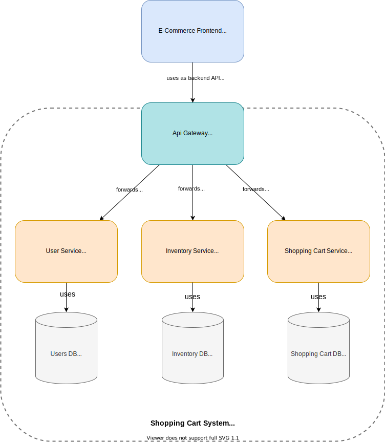

# Lesson - Microservices

In this lesson we'll look at a microservices application utilizing [Express Gateway](https://www.express-gateway.io/) as our API gateway, fronting two simple node.js services.

[Component Diagram](https://drive.google.com/file/d/1AOFZuwlm8veRhAvvE36qr0prOPoWxDNR/view?usp=sharing)

